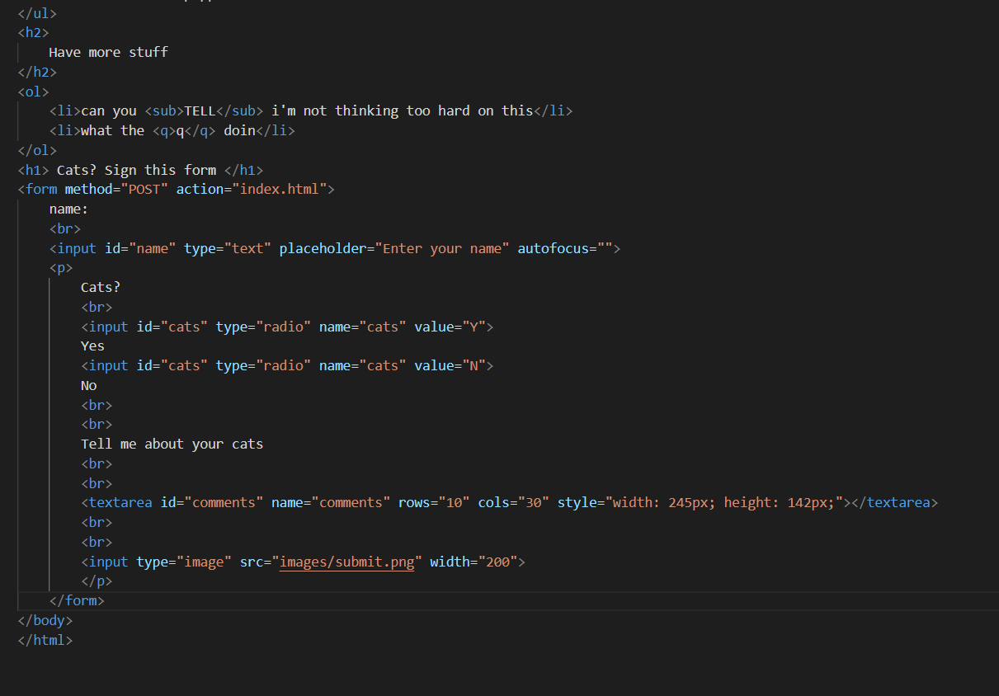

I think an easy form sumission that we have is the one we use to submit homework each week. You can upload files and then hit submit each and every week. Other than that the one someone typically uses is the login screen, when they put in their form for their user and then hit sumbit to gain access to their account. 

